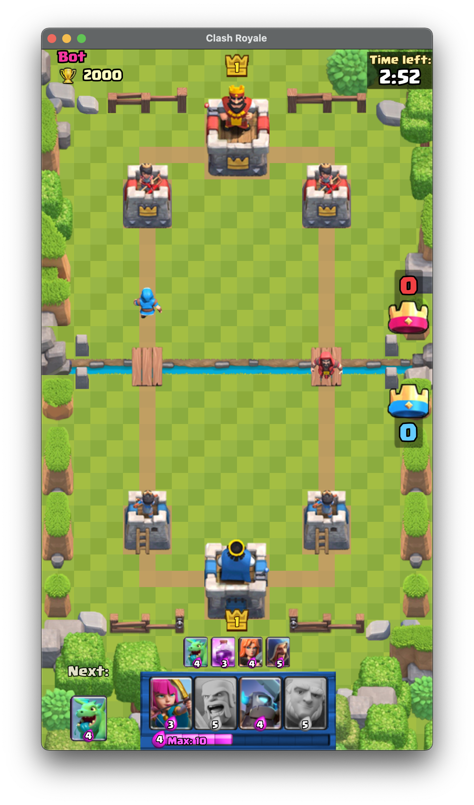
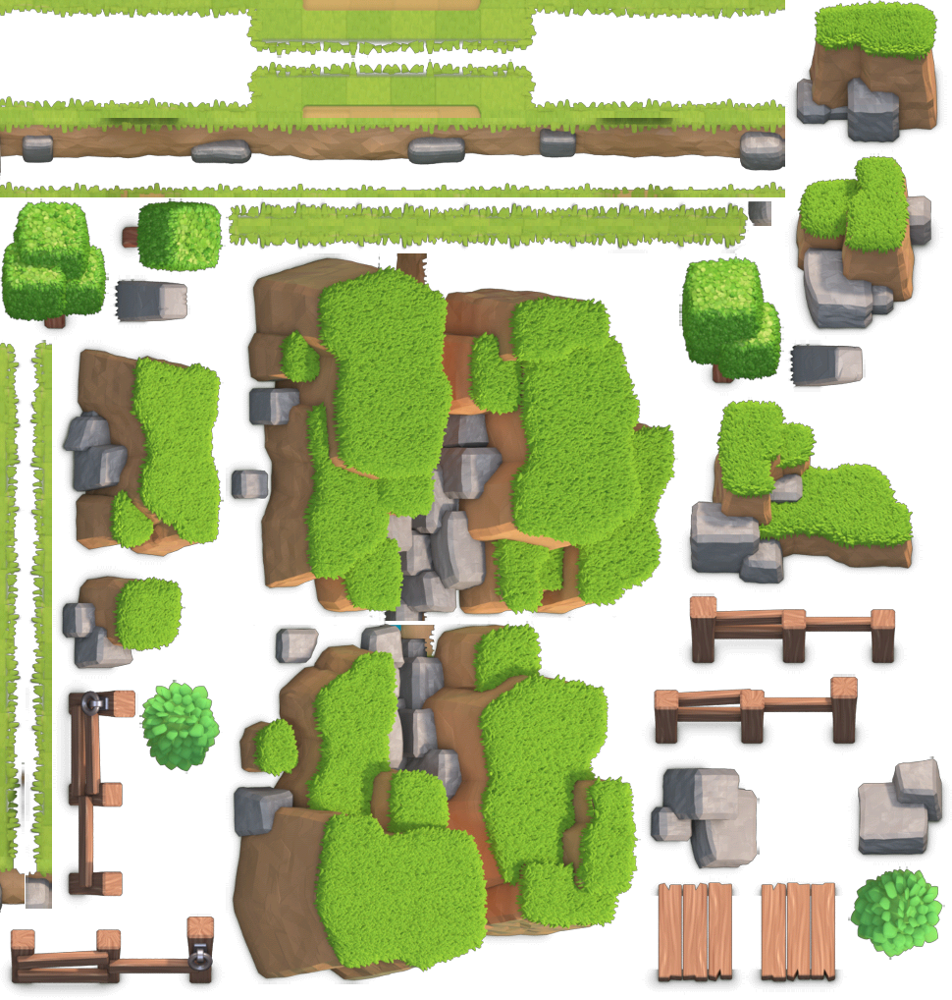
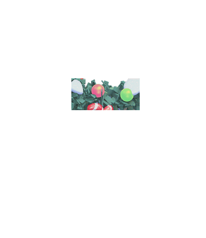
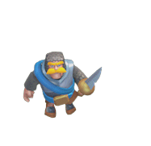

# Feature Specification: Official Assets UI for Clash Royale Clone

**Feature Branch**: `001-official-assets-ui`
**Created**: 2026-03-25
**Status**: Draft
**Input**: Build Clash Royale clone with official assets and Canvas rendering

---

## 🎨 Visual Reference

### Expected Final Result

The game UI should look like this:


*A real Clash Royale game screen - our target visual appearance*

### Key Visual Elements

#### 1. Arena (Ground)

*Official arena_training_tex.png (970x1018 pixels)*

#### 2. Tower Sprites

*Official tower sprite (407x471 pixels per frame, 214 frames total)*

#### 3. Unit Sprites (Example: Knight)

*Official knight sprite (187x181 pixels per frame)*

---

## 📐 UI Layout

### Screen Layout (Portrait 9:16)

```
┌─────────────────────────────────────┐
│           ⏱️ 2:48                    │  ← Timer (top center)
├─────────────────────────────────────┤
│  💜 YOU:10                          │  ← Elixir bars
│                              💜 5   │
├─────────────────────────────────────┤
│                                      │
│    👹         👑          👹        │  ← Enemy towers
│  (Princess) (King)    (Princess)    │
│                                      │
│                                      │
│         ═════════════════           │  ← River
│          🌉       🌉                 │  ← Bridges
│         ═════════════════           │
│                                      │
│                                      │
│    👹         👑          👹        │  ← Player towers
│  (Princess) (King)    (Princess)    │
│                                      │
├─────────────────────────────────────┤
│  ┌─────┐ ┌─────┐ ┌─────┐ ┌─────┐   │  ← Card hand
│  │ 3💧 │ │ 5💧 │ │ 4💧 │ │ 4💧 │   │     (4 cards)
│  │ ⚔️  │ │ 🧙  │ │ 🐗  │ │ 🔫  │   │
│  └─────┘ └─────┘ └─────┘ └─────┘   │
└─────────────────────────────────────┘
```

### Dimensions

| Element | Size (approx) | Position |
|---------|---------------|----------|
| Arena | 720x900px | Center |
| Timer | 120x50px | Top center |
| Elixir Bar | 30x200px | Left/Right sides |
| Princess Tower | 80x120px | Sides of arena |
| King Tower | 100x140px | Center of each side |
| Card | 120x150px | Bottom |
| Unit (Knight) | 60x60px | On arena |

---

## User Scenarios & Testing *(mandatory)*

### User Story 1 - Arena Display (Priority: P1)

As a player, I want to see the Clash Royale arena with official textures so that the game looks authentic.

**Visual Expected Result**:
- Arena background shows the training arena texture
- Ground has grass texture with proper scaling
- River divides the arena horizontally
- Two bridges connect the sides

**Why this priority**: The arena is the foundation of the entire game UI.

**Independent Test**: Load arena texture, verify it matches reference screenshot.

**Acceptance Scenarios**:

1. **Given** the game loads, **When** the arena initializes, **Then** the official arena texture (970x1018) is displayed, matching the reference image
2. **Given** the arena is displayed, **When** the window resizes, **Then** the arena scales proportionally maintaining 9:16 aspect ratio

---

### User Story 2 - Tower Display with Animation (Priority: P2)

As a player, I want to see towers rendered with official sprites and animations so that the game feels authentic.

**Visual Expected Result**:
- 3 towers per team (2 princess + 1 king)
- Towers have stone texture appearance
- Idle animation plays (slight movement)
- Attack animation when shooting
- Health bar above each tower

**Why this priority**: Towers are critical game elements.

**Independent Test**: Place towers on arena, verify sprites and animations match reference.

**Acceptance Scenarios**:

1. **Given** towers are placed on the arena, **When** the game renders, **Then** towers display with official sprites matching the reference image
2. **Given** a tower is idle, **When** rendering, **Then** the idle animation plays at 8 FPS
3. **Given** a tower takes damage, **When** health changes, **Then** the health bar updates visually

---

### User Story 3 - Unit Display with Animation (Priority: P3)

As a player, I want to see units rendered with official sprites and animations so that the game feels authentic.

**Visual Expected Result**:
- Units appear with proper sprite graphics (not geometric shapes!)
- Each unit has distinct visual appearance
- Walk animation when moving
- Attack animation when fighting
- Health bar above each unit

**Why this priority**: Units are essential for gameplay.

**Independent Test**: Spawn a unit, verify its appearance matches reference.

**Acceptance Scenarios**:

1. **Given** a unit is spawned, **When** it appears, **Then** it displays with the official sprite matching reference images
2. **Given** a unit moves, **When** walking, **Then** the walk animation plays at 12 FPS
3. **Given** a unit attacks, **When** attacking, **Then** the attack animation plays at 15 FPS

---

### User Story 4 - UI Elements (Priority: P4)

As a player, I want to see the timer, elixir bar, and card hand so that I can play the game.

**Visual Expected Result**:

**Timer**:
- Blue background box with gold border
- White text showing time in M:SS format
- Positioned at top center

**Elixir Bar**:
- Purple gradient fill
- Vertical bar on left (player) and right (enemy)
- Number showing current elixir (0-10)

**Card Hand**:
- 4 cards at bottom
- Each card shows: cost badge, unit image, rarity border
- Selected card has highlight

**Why this priority**: UI elements are needed for gameplay.

**Independent Test**: Display each UI element, verify appearance.

**Acceptance Scenarios**:

1. **Given** the game starts, **When** UI initializes, **Then** timer shows "3:00" with correct styling
2. **Given** elixir regenerates, **When** it reaches 10, **Then** the purple bar shows full
3. **Given** a card is selected, **When** clicking, **Then** the card has a highlight border

---

## 🎯 Success Criteria

### Visual Fidelity Check

Compare our implementation with reference screenshots:

| Element | Reference | Acceptance Criteria |
|---------|-----------|---------------------|
| Arena texture | See reference-game.png | Must match exactly |
| Tower appearance | See tower-sprite.png | Must use official sprites |
| Unit appearance | See knight-sprite.png | Must use official sprites |
| Colors | Extracted from assets | Must match official palette |
| Proportions | Real game | Must match within 5% |

### Performance Criteria

- **SC-001**: Arena texture loads within 2 seconds
- **SC-002**: Game maintains 60fps with 10+ units
- **SC-003**: Visual comparison shows >90% similarity to reference screenshots
- **SC-004**: All sprites render at correct positions and scales

---

## Requirements *(mandatory)*

### Functional Requirements

- **FR-001**: System MUST render the arena using official arena_training_tex.png
- **FR-002**: System MUST render towers using official sprites from building_tower_out/
- **FR-003**: System MUST render units using official sprites from chr_*/ directories
- **FR-004**: System MUST implement frame-based sprite animation
- **FR-005**: System MUST use HTML5 Canvas for all rendering
- **FR-006**: System MUST support 5 rendering layers
- **FR-007**: System MUST maintain 60fps
- **FR-008**: UI MUST visually match the reference screenshots

---

## 📁 Asset Files

### Required Assets

| Asset | Path | Size |
|-------|------|------|
| Arena texture | `assets/sc/arena_training_tex.png` | 970x1018 |
| Tower sprites | `assets/sc/building_tower_out/*.png` | 407x471 (214 files) |
| Knight sprites | `assets/sc/chr_knight_out/*.png` | 187x181 (~50 files) |
| Archer sprites | `assets/sc/chr_archer_out/*.png` | 130x135 (~40 files) |
| Giant sprites | `assets/sc/chr_giant_out/*.png` | 189x185 (~40 files) |

---

## Assumptions

- Official assets available from smlbiobot/cr-assets-png
- Canvas rendering sufficient (no WebGL)
- Single-player mode initially
- Portrait mode (9:16) primary target